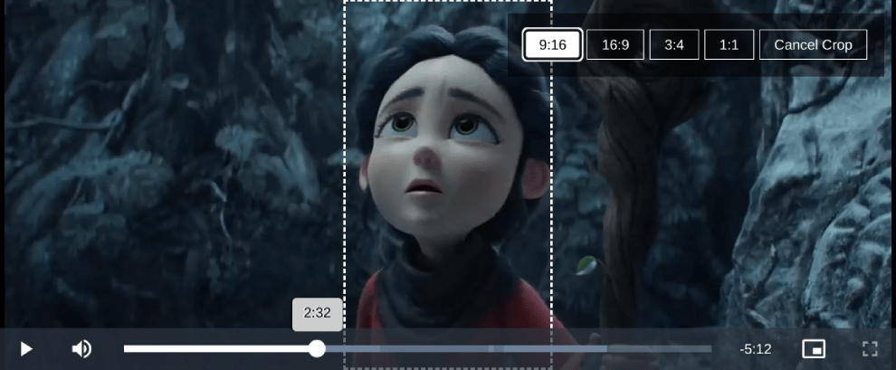

# Video.js Crop Plugin

The Video.js Crop Plugin enhances video playback by adding visual cropping functionality. It enables users to interactively select a specific crop area within the video by dragging a visual overlay.



## Compatibility

This plugin version is compatible with Video.js v8.x.

## Getting Started

### Prerequisites

Make sure you have [Video.js](https://videojs.com/) installed in your project before using this plugin.

### Installation

Include the Video.js library and the `videojs-crop` files in your HTML file:

```html
<!-- Video.js library -->
<link href="https://vjs.zencdn.net/8.6.1/video-js.css" rel="stylesheet"/>
<script src="https://vjs.zencdn.net/8.6.1/video.min.js"></script>

<!-- Video.js Crop plugin -->
<link href="https://cdn.jsdelivr.net/gh/Teyuto/videojs-crop@main/src/videojs-crop.min.css" rel="stylesheet"/>
<script src="https://cdn.jsdelivr.net/gh/Teyuto/videojs-crop@main/src/videojs-crop.min.js"></script>
```

### Usage

Initialize Video.js as you normally would and add the Video.js Crop Plugin:

```javascript
// Create a video player
var player = videojs('my-video');

// Activate the Video JS Crop plugin
player.cropPlugin({
    aspectRatios: ['9:16', '16:9', '3:4', '1:1'],
    defaultAspectRatio: '9:16',
    onCropChange: (cropParams) => {
        console.log('Crop Parameters:', cropParams);
    }
});

// Optional: Handle event to monitor crop changes
onCropChange: (cropParams) => {
    console.log('Crop Parameters:', cropParams);
}
```
Make sure to replace `'my-video'` with your actual video player ID.


## Recommended Video Formats

It is recommended to use **video/mp4** format for the cropping functionality to ensure compatibility and performance. However, if you wish to use different formats such as HLS, ensure that you select the maximum version of the video or one that matches the encoding settings you will be using.

## Options

### Configuration Options

| Option                | Type              | Description                                      |
|-----------------------|-------------------|--------------------------------------------------|
| `aspectRatios`       | `Array`           | Array of aspect ratios available for cropping.   |
| `defaultAspectRatio`  | `String`         | The default aspect ratio to be selected on load. |
| `onCropChange`       | `Function`        | Callback function triggered on crop change.       |


## Crop Parameters Explained

The `onCropChange` callback provides an object containing the following parameters:

| Parameter                 | Description                                        |
|---------------------------|----------------------------------------------------|
| `aspectRatio.real`       | The real aspect ratio of the selected crop (e.g., `1.77` for `16:9`). |
| `aspectRatio.string`    | The selected aspect ratio as a string (e.g., `"16:9"`). |
| `position.player`         | The dimensions and position of the crop in the player’s coordinate system. |
| `position.player.w`       | Width of the crop overlay in the player.          |
| `position.player.h`       | Height of the crop overlay in the player.         |
| `position.player.x`       | X position of the crop overlay in the player.     |
| `position.player.y`       | Y position of the crop overlay in the player.     |
| `position.video`          | The dimensions and position of the crop in the video’s coordinate system. |
| `position.video.w`        | Width of the crop overlay in the video.           |
| `position.video.h`        | Height of the crop overlay in the video.          |
| `position.video.x`        | X position of the crop overlay in the video.      |
| `position.video.y`        | Y position of the crop overlay in the video.      |

Use the cordinates of the video and not the player to make the crop for example with ffmpeg.

## Example
Check the provided HTML `examples/index.html` file for a working example.

## License

This project is licensed under the MIT License - see the [LICENSE.md](LICENSE.md) file for details.

---